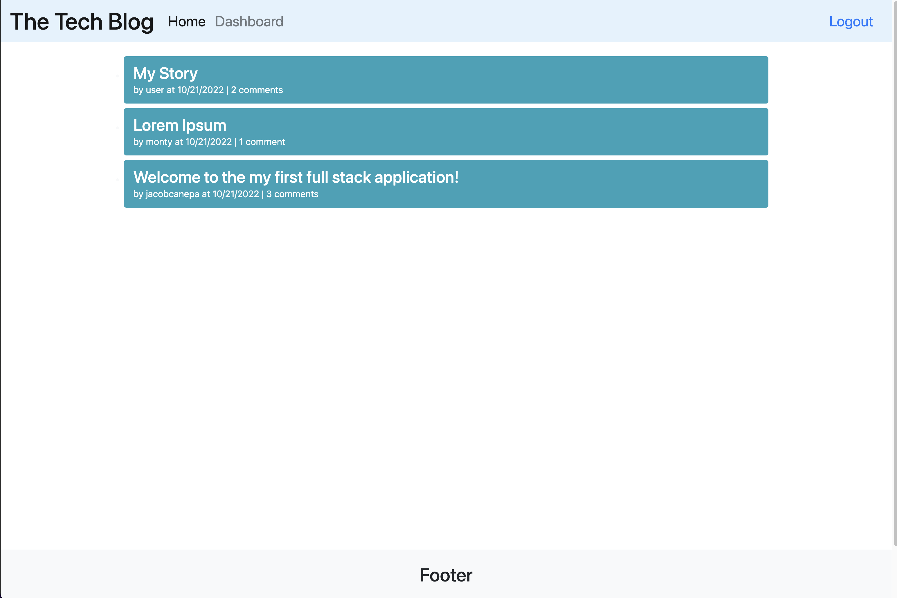

  # Jacob Canepa's Full Stack Tech Blog
  

  ## Description
  A full stack tech blog that allows users to create accounts in order to publish articles as well as comment on others. This app follows the MVC paradigm for its architectural structure.

  ## Table of Contents
  - [Installation](#installation)
  - [Questions](#questions)

  ## Installation
  ```
  npm install
  ```

  Make sure to create a .env file for MySQL info and session secret.

  ## Links
  https://jc-techblog.herokuapp.com/

  

  ## Questions
  Github: https://github.com/jacobmcanepa
  
  Email: jacobmcanepa@gmail.com

  LinkedIn: https://www.linkedin.com/in/jacob-canepa-568740198/
  
  